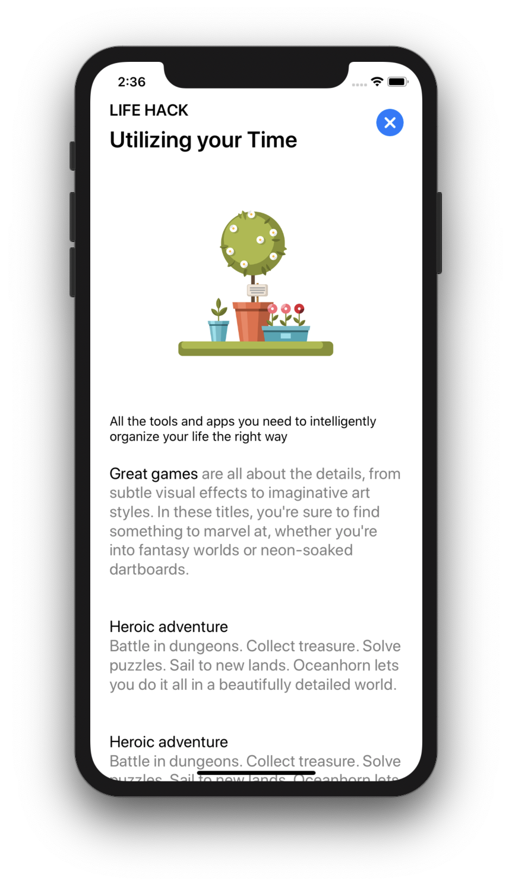
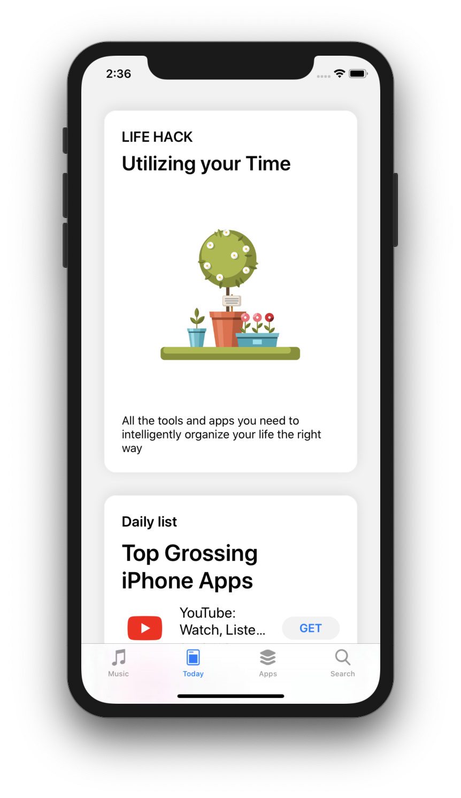
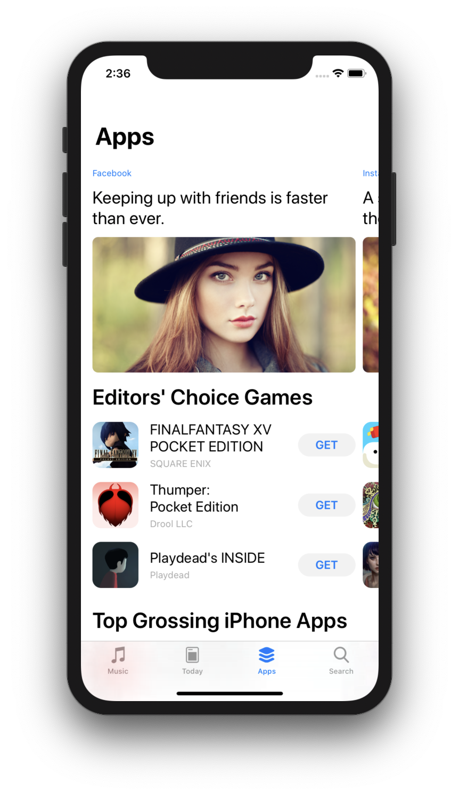
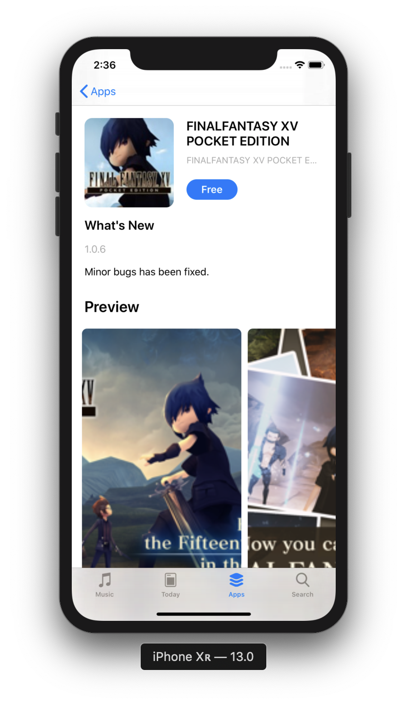
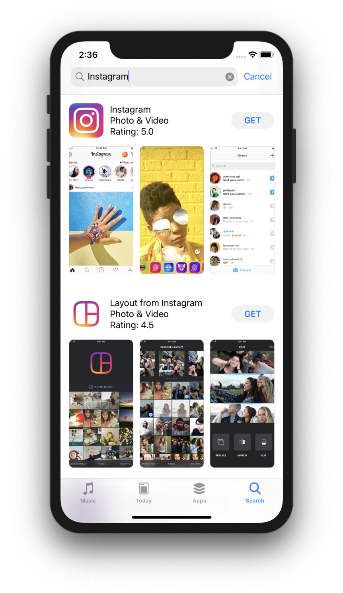

# AppStore-CopyJSON
Trying to recreate AppStrore using iTunes JSON API.

### Technologies 
 - MVC Architecture
 - SDWebImage for caching images
 - JSON is handled via models using the `Decodable` protocol
 
### Screenshots

 
 

